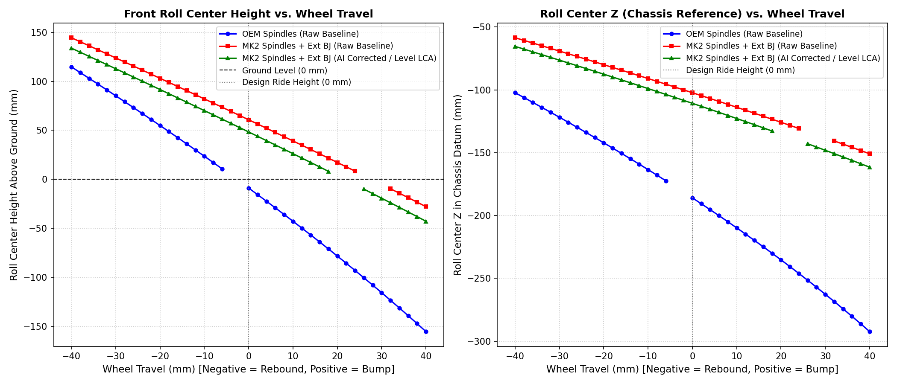

# Suspension Measurements for MK2_Spindles_VR6_Arms_Extended

## General Information

| Parameter | Value |
| :--- | :--- |
| **Event** | CSCC Chicane Challenge XXXIV |
| **Date** | 9/18-19/2026 |
| **Track** | PIR |
| **Laptime** | — |
| **Gas Level** | Full *(0 = Full, negative gas below full)* |

---

## Vehicle Weight & Corner Balance

| Metric | Value |
| :--- | :--- |
| **Weight (w/ wheels)** | 2,522 lbs |
| **Weight (w/ hubstands)** | 2,470 lbs |
| **Cross Weight** | 50.08% |
| **Front Bias** | 61.46% (1,518 lbs) |
| **Rear Bias** | 38.54% (952 lbs) |

### Corner Weights (Hubstands)

```
        FRONT
  [ FL ]     [ FR ]
  764 lbs    754 lbs
  ------------------
  483 lbs    469 lbs
  [ RL ]     [ RR ]
         REAR
```

| Axle / Side | Left | Right | Total |
| :--- | :--- | :--- | :--- |
| **Front** | 764 lbs | 754 lbs | 1,518 lbs |
| **Rear** | 483 lbs | 469 lbs | 952 lbs |
| **Total** | 1,247 lbs | 1,223 lbs | **2,470 lbs** |

---

## Axle Setup Overview

| Parameter | Front | Rear |
| :--- | :--- | :--- |
| **Toe Strings (mm)** | -2 | -6 |
| **Toe (1 mark = 1/16")** | — | — |
| **Toe Plate (mm)** | — | — |
| **Tender** | Helper | — |
| **Springs (lbs)** | 180-140 | 140-140 |
| **Rebound (Top turns out)** | 2.25 | — |
| **Bump (Clicks out)** | 2 | — |
| **ARB** | Full Soft | — |
| **Spoiler** | — | — |

---

## Corner Alignment & Geometry

| Parameter | Front Left (FL) | Front Right (FR) | Rear Left (RL) | Rear Right (RR) |
| :--- | :--- | :--- | :--- | :--- |
| **Caster** | -9.2° | -9.2° | — | — |
| **Camber (Air)** | -2.4° | -2.3° | — | — |
| **Camber (Ground)** | -2.6° | -3.0° | — | — |
| **Ride Height (mm)** | 130.29 | 123.65 | 240 | 230 |
| **Axle to Fender (mm)** | 12.11 | 14.15 | — | — |
| **Toe Strings (mm)** | -1 | -1 | -3 | -3 |
| **Shim** | — | — | 18 over 12 | 22 over 12 |

---

## Bump Steer Measurements

**Configuration:** Reseated Outer CV 5mm Spacer  
**Dial Gauge Spacing:** 34 cm (340 mm) between front and rear dial indicators

### Run 1

| Condition | Height Index / Travel (in) | Front Dial (in) | Rear Dial (in) | Delta (in) | Delta (mm) |
| :--- | :---: | :---: | :---: | :---: | :---: |
| **Ride Height** | 2 | 0.5000 | 0.5000 | 0.0000 | 0.0000 |
| **Compression** | 1 | 0.4145 | 0.5985 | -0.1840 | -4.6736 |
| **Rebound** | 3 | 0.5490 | 0.3670 | +0.1820 | +4.6228 |

### Run 2

| Condition | Height Index / Travel (in) | Front Dial (in) | Rear Dial (in) | Delta (in) | Delta (mm) |
| :--- | :---: | :---: | :---: | :---: | :---: |
| **Ride Height** | 2 | 0.5000 | 0.5000 | 0.0000 | 0.0000 |
| **Compression** | 1 | 0.4120 | 0.5980 | -0.1860 | -4.7244 |
| **Rebound** | 3 | 0.5475 | 0.3680 | +0.1795 | +4.5593 |

### Run 3

| Condition | Height Index / Travel (in) | Front Dial (in) | Rear Dial (in) | Delta (in) | Delta (mm) |
| :--- | :---: | :---: | :---: | :---: | :---: |
| **Ride Height** | 2 | 0.5000 | 0.5000 | 0.0000 | 0.0000 |
| **Compression** | 1 | 0.4135 | 0.5980 | -0.1845 | -4.6863 |
| **Rebound** | 3 | 0.5485 | 0.3665 | +0.1820 | +4.6228 |

---

## Kinematic Roll Center Comparison Across Configurations

Comparison of front roll center characteristics across the three simulation models at design condition (static ride height) and through bump/rebound travel.

### Design Condition (Static Ride Height)

| Simulation Configuration | LCA Outboard Ball Joint $Z$ | Ground Datum $Z$ | Roll Center $Z$ (Datum) | Roll Center $Y$ (Lateral) | Roll Center Height (Ground) | Roll Moment Arm ($Z_{CG} - Z_{RC}$) | Roll Leverage vs OEM |
| :--- | :---: | :---: | :---: | :---: | :---: | :---: | :---: |
| **[OEM Spindles (Raw Baseline)](file:///home/djhedges/Corrado_Kinematics/OEM_Spindles_VR6_Arms/raw/)**<br>OEM VR6 Spindles + OEM Ball Joints | $+9.00\text{ mm}$<br>*(slopes upward)* | $-177.02\text{ mm}$ | $-185.95\text{ mm}$ | $0.00\text{ mm}$ | **$-8.93\text{ mm}$ ($-0.35"$)**<br>*(Underground)* | $473.73\text{ mm}$ ($18.65"$) | *Baseline* |
| **[MK2 Spindles + Ext BJ (Raw Baseline)](file:///home/djhedges/Corrado_Kinematics/MK2_Spindles_VR6_Arms_Extended/raw/)**<br>MK2 Spindles + Extended Ball Joints | $-6.00\text{ mm}$<br>*(slopes downward)* | $-163.02\text{ mm}$ | $-102.25\text{ mm}$ | $0.00\text{ mm}$ | **$+60.77\text{ mm}$ ($+2.39"$)** | $404.03\text{ mm}$ ($15.91"$) | **-14.7%** |
| **[MK2 Spindles + Ext BJ (AI Corrected)](file:///home/djhedges/Corrado_Kinematics/MK2_Spindles_VR6_Arms_Extended/ai_corrected/)**<br>MK2 Spindles + Level LCA ($Z=0$) + Setup Camber | $0.00\text{ mm}$<br>*(level with pivot)* | $-159.01\text{ mm}$ | $-110.68\text{ mm}$ | $-15.79\text{ mm}$<br>*(toward FL)* | **$+48.32\text{ mm}$ ($+1.90"$)** | $416.48\text{ mm}$ ($16.40"$) | **-12.1%** |

*Note: Center of Gravity (CG) height measured at $18.3" / 464.8\text{ mm}$ above ground.*

### Roll Center Height vs. Wheel Travel (-40mm Rebound to +40mm Bump)

| Wheel Travel (mm) | Suspension State | OEM Spindles (Raw) | MK2 Spindles + Ext BJ (Raw) | MK2 Spindles + Ext BJ (AI Corrected) |
| :---: | :---: | :---: | :---: | :---: |
| **-40.0 mm** | Full Rebound | $+114.75\text{ mm}$ ($+4.52"$) | $+144.48\text{ mm}$ ($+5.69"$) | $+133.85\text{ mm}$ ($+5.27"$) |
| **-20.0 mm** | Moderate Rebound | $+54.90\text{ mm}$ ($+2.16"$) | $+103.09\text{ mm}$ ($+4.06"$) | $+91.62\text{ mm}$ ($+3.61"$) |
| **0.0 mm** | **Design Ride Height** | **$-8.93\text{ mm}$ ($-0.35"$)** | **$+60.77\text{ mm}$ ($+2.39"$)** | **$+48.32\text{ mm}$ ($+1.90"$)** |
| **+20.0 mm** | Moderate Bump | $-78.29\text{ mm}$ ($-3.08"$) | $+17.22\text{ mm}$ ($+0.68"$) | *Transition corridor* |
| **+40.0 mm** | Full Bump (Compression) | **$-155.36\text{ mm}$ ($-6.12"$)** | **$-27.89\text{ mm}$ ($-1.10"$)** | **$-42.77\text{ mm}$ ($-1.68"$)** |




